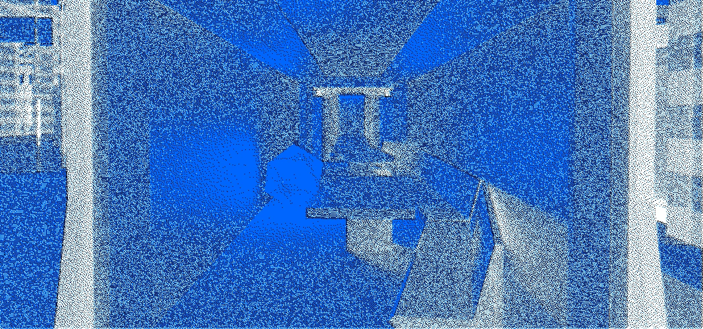

<h1>Веб-плакат Мытро: Издание легенды</h1>

<h2>Что это</h2>

Это моя студенческая работа в Школе дизайна НИУ ВШЭ по созданию веб-плаката, то есть интерактивного сайта, который посвящен моему фирменному стилю

<h2>Концепция</h2>

Метро — место, где проходит множество людей и не замечают друг друга. При этом их внимание рассеянно, временной ресурс расходуется неэффективно. Поэтому, в рамках курса Школы, я пытаюсь переосмыслить пространство и досуг в вагоне. Чтобы показать, как можно весело проводить время, я создал веб-плакат

Веб-плакат следует концепции
